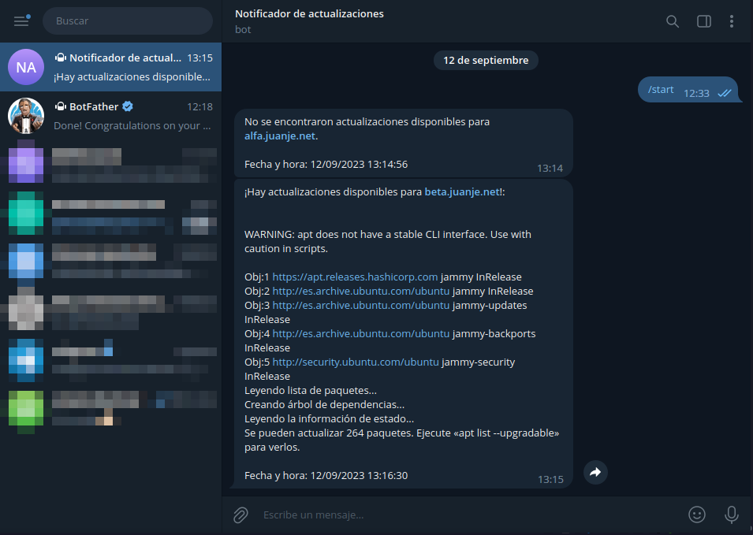
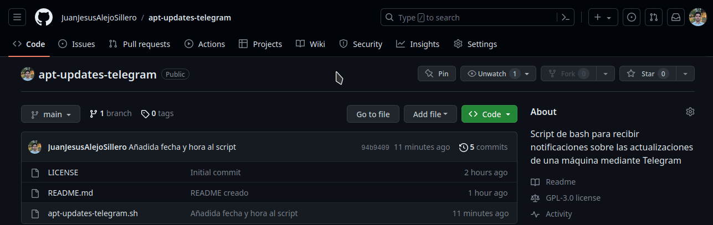

# **Notificador de Actualizaciones por Telegram**

Este repositorio contiene un script de Bash que te permite recibir notificaciones en tu cuenta de Telegram cada vez que haya actualizaciones disponibles en tu sistema. Puedes configurar este script para que se ejecute periódicamente a través de un *timer de systemd* o *cronjob* y recibir notificaciones instantáneas sobre las actualizaciones disponibles.

## **Requisitos**

Antes de utilizar este script, asegúrate de tener lo siguiente:

- Una cuenta de Telegram.
- Un bot de Telegram y su correspondiente token.
- El ID de nuestro chat con el bot.
- Tener `apt` como gestor de paquetes en tu sistema. Si utilizas un gestor diferente, deberás adaptar este script.
- Tener `curl` instalado.

> Si no dispones de un bot de telegram, su token o el ID de tu chat con él, puedes seguir las instrucciones disponibles en este post:
>
> [Notificador de Actualizaciones por Telegram](https://blog.juanje.net/blog/2023/09/notificador-de-actualizaciones-por-telegram/)

## **Configuración**

Sigue estos pasos para configurar el script:

1. Clona este repositorio en tu sistema:

```bash
git clone https://github.com/JuanJesusAlejoSillero/apt-updates-telegram.git
```

2. Edita el archivo `apt-updates-telegram.sh` y modifica las siguientes variables con tus valores:

- BOT_TOKEN: El token de tu bot de Telegram. Se obtiene de [botfather](https://t.me/botfather).
- CHAT_ID: El ID del chat donde deseas recibir las notificaciones. Puedes obtenerlo de varias formas. Las instrucciones completas están en mi [blog](https://blog.juanje.net/).

3. Dale permisos de ejecución al script:

```bash
chmod +x apt-updates-telegram.sh
```

4. Prueba su funcionamiento ejecutándolo manualmente:

```bash
./apt-updates-telegram.sh
```

Si todo ha ido bien recibirás un mensaje informándote de las actualizaciones disponibles, o, en su defecto, de la ausencia de estas:



> **Por favor, si te ha sido útil el script considera darle una estrella al repositorio de GitHub y/o compartirlo para que llegue a más gente**
>
> 

## **Programar la ejecución del script**

Instrucciones disponibles en este post:

[Se publicará próximamente, disculpe las molestias](https://blog.juanje.net/)

---

✒️ **Documentación realizada por Juan Jesús Alejo Sillero.**
